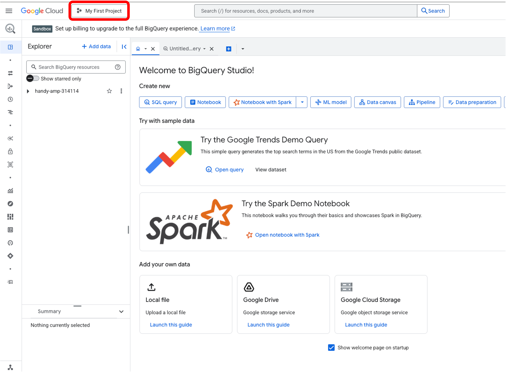
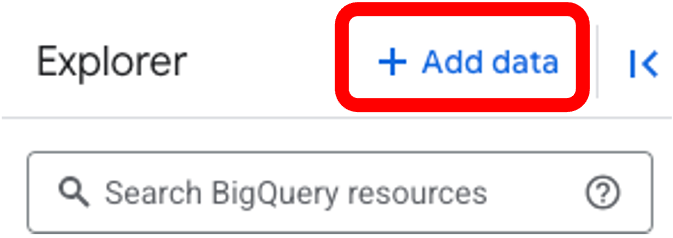
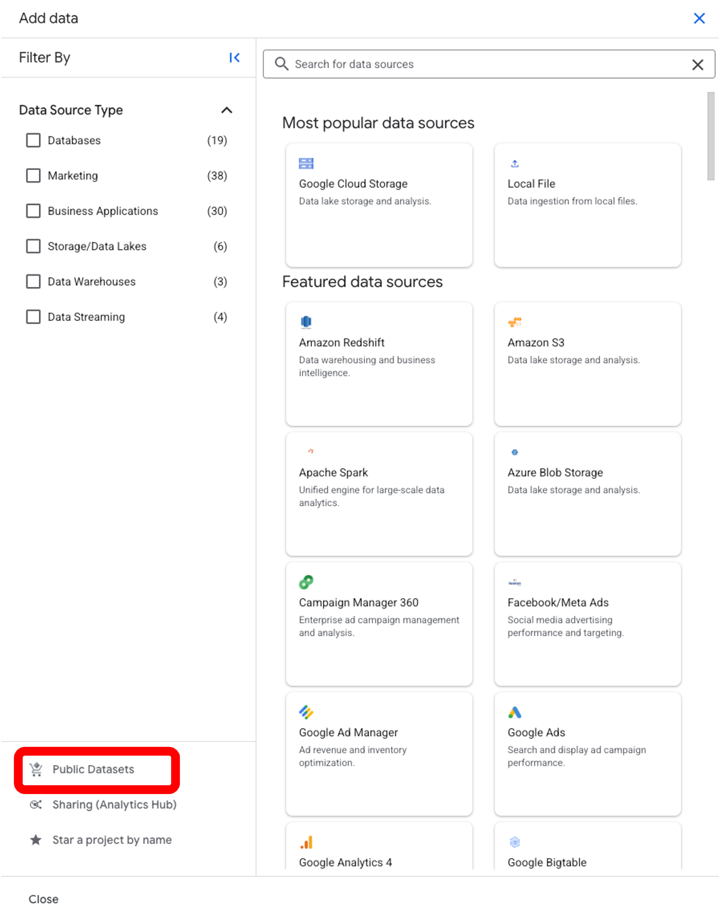
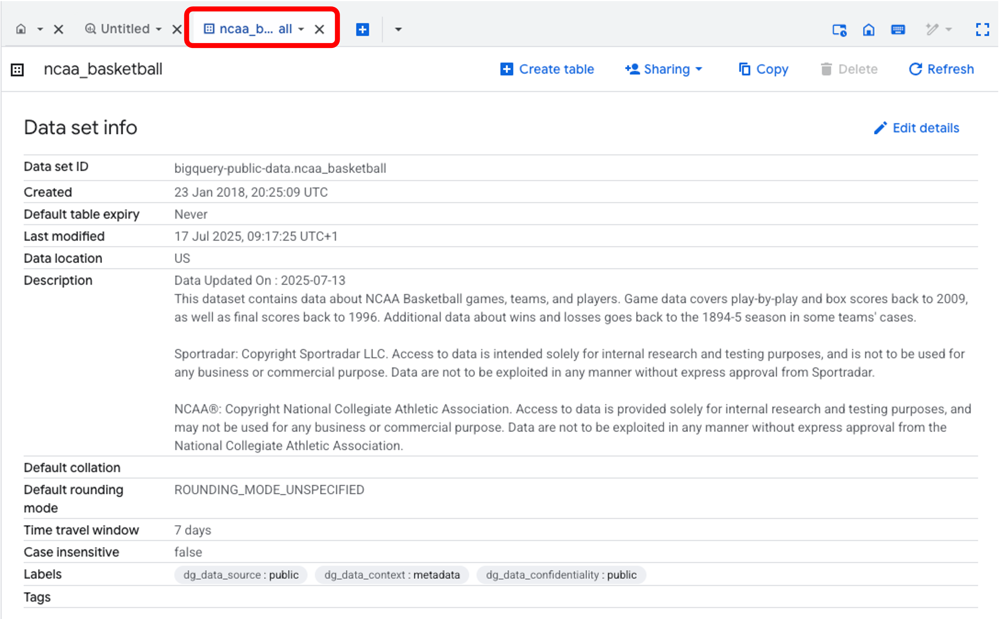
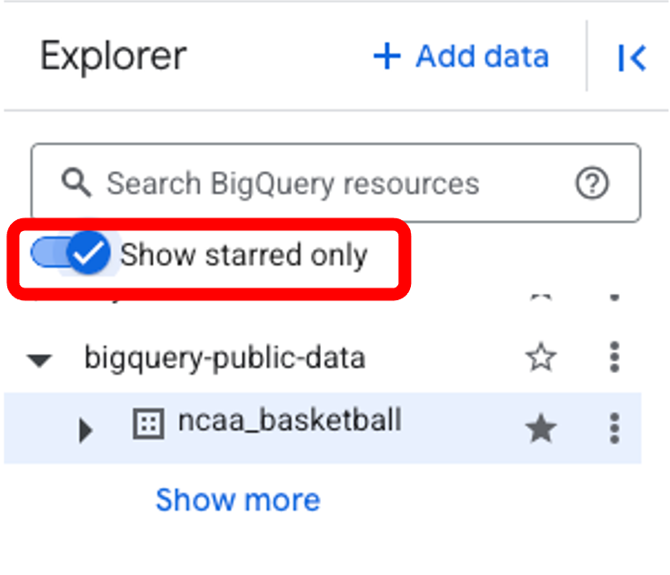
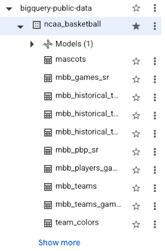
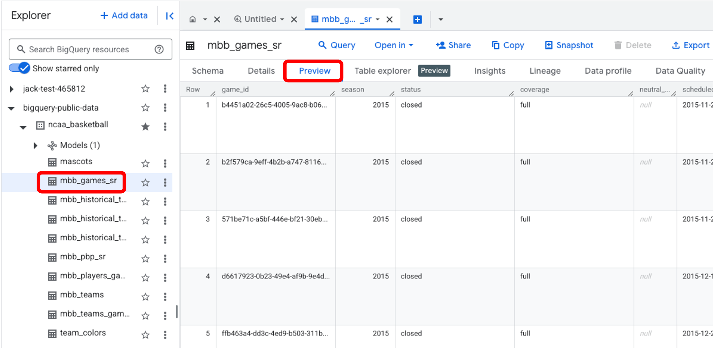

<h1>
  SQL I Introduction to Queries and BigQuery
  Set-Up Guide: BigQuery Sandbox, Adding a Public Data set, and Exploring your Data set
</h1>

This guide provides a step-by-step walkthrough for setting up a Google Cloud Project and BigQuery Sandbox, as well as exploring the `ncaa_basketball` data set. This is a prerequisite step for the Intro to SQL using BigQuery Modules.

**Data set:** `bigquery-public-data.ncaa_basketball`

**Tool:** BigQuery (You'll need a Google account to access BigQuery)

_Note: the SQL modules (and this guide) are designed so that you do not need to pay anything (or enter any credit card details) on GoogleCloud to follow along and do the exercises._

**Learning Objectives:**

*At the end of this section, you will be able to:*

* Set up a Google Cloud Project and BigQuery Sandbox.
* Understand how to add a BigQuery Public Data set to your project.
* Understand how to explore a new data set in BigQuery.

---

## Content
- [Set up](#set-up)
- [1. Setting up Google Cloud Project and BigQuery Sandbox](#1-setting-up-google-cloud-project-and-bigquery-sandbox)
- [2. Adding the `ncaa_basketball` BigQuery Public Data set](#2-adding-the-ncaa_basketball-bigquery-public-data-set)
- [3. Exploring the `ncaa_basketball` Data set](#3-exploring-the-ncaa_basketball-data-set)
- [4. Optional:](#4-optional)

# Set up

# 1. Setting up Google Cloud Project and BigQuery Sandbox

Since you will be using Google's [BigQuery](https://cloud.google.com/bigquery/) for this lesson, you need to do a bit of setup before you get started.

Please follow the steps in the first section of this guide (**Start using the BigQuery sandbox**): [Enable the BigQuery sandbox](https://cloud.google.com/bigquery/docs/sandbox).  **_Don't complete the 'Upgrade from the BigQuery sandbox' section._**

**Note:** you should not need to enter any credit card details during set up. You also don't need to upgrade your BigQuery sandbox to a paid plan by enabling billing (which is the last step in the guide linked above).

Once you have successfully set up the sandbox, your page should look like this:

You now have a Google Cloud project called `My First Project` (or whatever you chose to call it).

# 2. Adding the `ncaa_basketball` BigQuery Public Data set

Although you have a project, you don't yet have data to explore.  You will need to add the `ncaa_basketball` data set to your project:

1.  Click on `+ Add data` in the Explorer panel (left side):

After clicking on the `+ Add data` button, you will see the following:

1.  Type `ncaa basketball` in the search bar and press Enter.

2.  Click on the **NCAA Basketball** tile, then click on `View data set`.

**Note**: A new browser tab opens, and you are now in `BigQuery Studio`, and you have all the public data sets listed in the Explorer panel beneath your project name, opened to `ncaa_basketball`.

There is a tab open within the `Studio` that has the metadata for the basketball data set.

In the Explorer panel on the left side:
1. The `ncaa_basketball` data set should be starred.  If it's not then star it.  Your project should also be starred in the Explorer panel.

2. Now select `Show starred only` in the top of the Explorer panel.  You will now be able to see only the basketball data set, and - if you expand it - its tables.

If `bigquery-public-data` is not present in the `Explorer` panel:
1.  click on the `+ Add Data` then select `Star a project by name`.

2.  In the pop up, type `bigquery-public-data` and click **Star**.

# 3. Exploring the `ncaa_basketball` Data set

1.  Click on the `bigquery-public-data > ncaa basketball` to view the tables you can explore.

2.  Click on **mbb_games_sr** (men's NCAA game results table) and then click the **Preview** tab to see sample rows of data.

3.  Click the **Details** tab to get metadata about the table.

4.  Click the **Schema** tab to see details of the columns within the table.

**Question:** How many games does the data set contain? How big is the table?

<b>Answer</b>

The table is about 50 MB and there are over 29k games for us to explore.

**Question:** And how many individual plays can we analyze?

__Hint:__

*   Click on the `mbb_pbp_sr (play-by-play)` table in the Explorer panel.

*   Then click **Details**

<b>Answer</b>

Over 4 million individual plays of basketball.

# 4. Optional:
You can explore other public data sets available in BigQuery by using this link: [Google Cloud Public Data sets](https://console.cloud.google.com/marketplace/browse?filter=solution-type:dataset)

You can set up other projects to work with these data sets. To do this, click on your project name at the top of the page (`My-First-Project` in the example above), then click on `Create Project` in teh top right of the pop up that appears.  Alternatively, you can follow [these instructions](https://cloud.google.com/resource-manager/docs/creating-managing-projects).

That's it!  You now have the data set ready to go in your BigQuery Sandbox for us to learn and practice SQL.

We will learn how to write a query in BigQuery in the next markdown file.