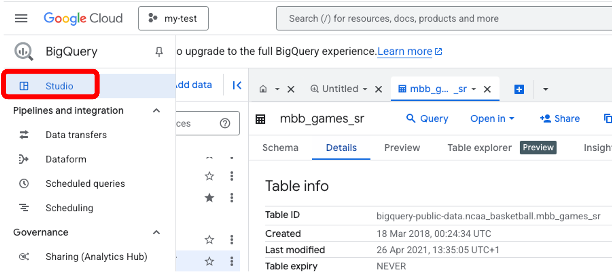
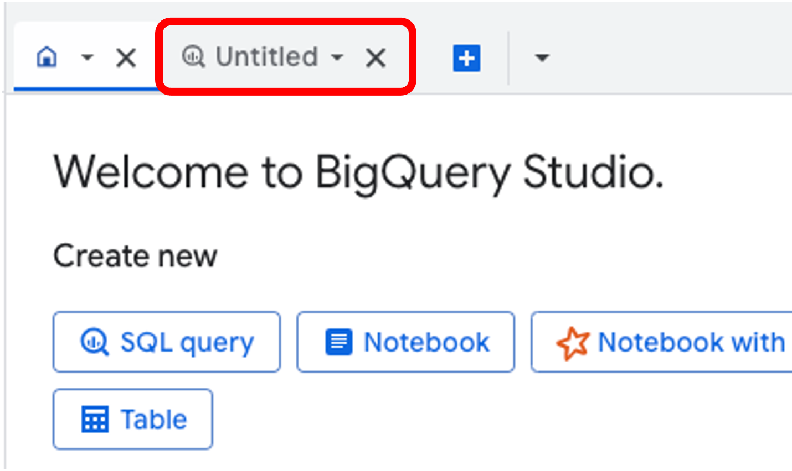
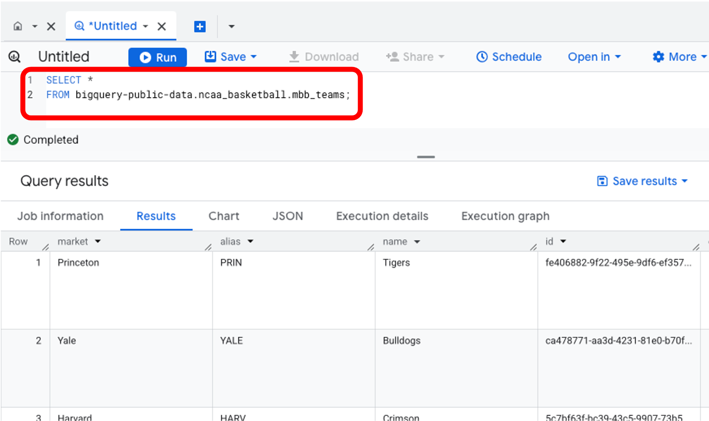
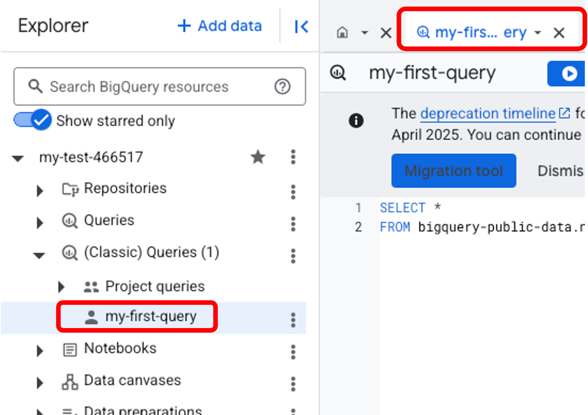
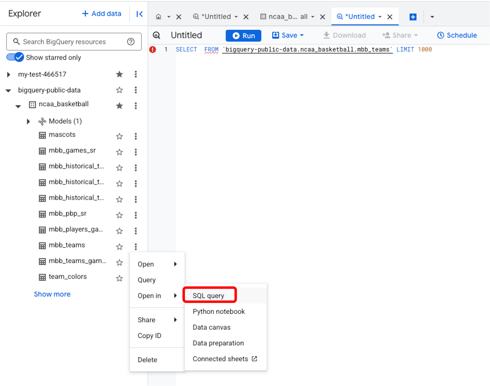

<h1>
  <span class="headline">SQL I Introduction to Queries and BigQuery</span>
  <span class="subhead">Intro to SQL Module I - Queries</span>
</h1>

This module establishes a baseline understanding of basic SQL syntax, data types, and simple query construction within BigQuery. It uses BigQuery's public `ncaa_basketball` data set.

**Data set:** `bigquery-public-data.ncaa_basketball`

**Tool:** BigQuery (You'll need a Google Cloud Project to access BigQuery)

_Note: this module is designed so that you do not need to pay anything (or enter any credit card details) on GoogleCloud to follow along and do the exercises._


**Learning Objectives:**

*You will be able to:*

* Write and execute a simple SQL query, including `SELECT`, `FROM`, `LIMIT`, and `DISTINCT`.
* Order data using `ORDER BY`.
* Alias tables in SQL using `AS`.
* Aggregate numerical data in SQL using `SUM()`, `COUNT()`, and `AVG()`.

---

## Content
- [Part 1: Basic queries with `SELECT`, `FROM`, `LIMIT`, and `DISTINCT`](#part-1-basic-queries-with-select-from-limit-and-distinct)
  - [`SELECT` and `FROM`](#select-and-from)
  - [A comment about comments](#a-comment-about-comments)
  - [How can we run a SQL query in BigQuery?](#how-can-we-run-a-sql-query-in-bigquery)
  - [`LIMIT`](#limit)
  - [`DISTINCT`](#distinct)
- [Part 2: Ordering data with `ORDER BY`](#part-2-ordering-data-with-order-by)
  - [`ORDER BY`](#order-by)
- [Part 3: Aliasing tables and column names with `AS`](#part-3-aliasing-tables-and-column-names-with-as)
- [Part 4: Aggregating Data with `COUNT()`, `SUM()`, and `AVG()`](#part-4-aggregating-data-with-count-sum-and-avg)
  - [`COUNT()`, `SUM()`, and `AVG()`](#count-sum-and-avg)
- [Query Order](#query-order)
  - [**Optional Further Exploration**](#optional-further-exploration)


## Prerequisites

- Familiarity with data types (e.g., strings, integers, floats, booleans)
- Have BigQuery set up, with the `ncaa_basketball` data set in a sandbox (see [here](../02-setup/02-bigquery-setup-guide.md) if you haven't done this yet)


# Part 1: Basic queries with `SELECT`, `FROM`, `LIMIT`, and `DISTINCT`

## `SELECT` and `FROM`

To retrieve data from a SQL database, the two primary clauses that must be present in every query are `SELECT` and `FROM`.

- Which columns do you want (`SELECT`)?
- and `FROM` which table?

For example, to get the names of all users from a table, you would write:

```SQL
SELECT user_name
FROM users;
```
The code above returns "user names" from a table called "users"

## A comment about comments
```
-- This is how you write a comment in SQL, using '--'. Anything in this line won't run as part of your query.

```

Now, since you want to retrieve data from the `ncaa_basketball` data set, you need to specify the data set and table in your query. For example:

```SQL
-- Select all columns from the mbb_teams table

SELECT *
FROM bigquery-public-data.ncaa_basketball.mbb_teams;
```


## How can we run a SQL query in BigQuery?

Open up BigQuery and go to `Studio`.  If you ever need to get to `Studio` from within BigQuery, you can click on the left hand navigation bar and choose `Studio`.



Make sure you are in your project.

To open up a query window, click on the 'Untitled' tab at the top.



You can now type SQL into this window, and see the output of the query by clicking 'Run' at the top.  Copy the code above to see all columns from the `mbb_teams` table.




You can save the results of any query by using the `Save results` button in the top right corner of the results panel.  (Note: you must use `Save query (classic)` unless you are paying for Google BigQuery.)

Saved queries are visible by expanding out your project in the Explorer panel.



You can write more than one query in the window. All of the queries will run when you click 'Run', and you will then be able to select which to view in the window below.

If you're not sure of the address of the table you want to use, navigate to it in the Explorer panel, and then click on the 3 dots to the right of the name, select 'Open In' and then 'SQL query'.  A new SQL window will open with a template statement already written.




## `LIMIT`

Rather than returning everything from a given table, you can request a specific number of rows. This is done with `LIMIT`.
```SQL
-- Select the first 10 team names from the mbb_teams table

SELECT name
FROM bigquery-public-data.ncaa_basketball.mbb_teams
LIMIT 10;
```

**Explanation**

* `SELECT` specifies the columns you want to retrieve.
* `FROM` indicates the table where the data resides.
* `LIMIT` restricts the number of rows returned.


**Your turn to practice**

**Exercise 1.1**
Write a query to:

1. Select all columns from the `mascots` table.

```SQL

```

2. Select the first 20 team names and their market names from the `mbb_teams` table.

```SQL

```

**Stretch Challenge 1.1**
- Get the colors of all the teams (Hex codes). __Hint__: you will need to identify the correct table to retrieve this data from.
```SQL

```

## `DISTINCT`

- `DISTINCT` returns a list of **unique** values from a given column:

```SQL
-- Get the distinct conferences from the `mbb_teams` table (returns unique value, i.e., no duplicates)

SELECT DISTINCT conf_name
FROM bigquery-public-data.ncaa_basketball.mbb_teams;

```

**Exercise 1.2**
1. Find out how many unique seasons are in the data set. You can use the `mbb_games_sr` table.
```SQL

```
2. Get unique colors (hex codes) from the `team_colors` table.
```SQL

```

**Stretch Challenge 1.2**
- Find all unique combinations of conference names (conf_name) and venue names (venue_name) in the `mbb_teams` table.
```SQL

```

**Discussion Points**
- Notice how `DISTINCT` works across all selected columns as a combination
- More columns generally mean more unique combinations (try it out!)
- Consider which combinations of columns provide meaningful insights


# Part 2: Ordering data with `ORDER BY`

## `ORDER BY`

Sometimes it makes sense to order your query on a certain column. For example, you might want to order team members alphabetically by last name: 

```SQL
-- Order team members alphabetically by last name
SELECT distinct last_name,
FROM `bigquery-public-data.ncaa_basketball`.mbb_players_games_sr
ORDER BY last_name DESC;
```

**Sub-section Recap**

* `ORDER BY` sorts the results based on the specified column(s).
* `DESC` sorts in descending order (largest to smallest).
* `ASC` sorts in ascending order (smallest to largest).  Ascending is the default if not specified.


**Exercise 2.1**

1. Find out which teams have the biggest arenas. Get the team name, city (`market`), and venue capacity. Then sort the results by venue capacity from largest to smallest.
```SQL

```

**Stretch Challenge 2.1**
Select the team names and conference names from `mbb_teams`, ordered by conference name alphabetically, then by team name alphabetically within each conference. Limit the results to the top 50.
```SQL

```

# Part 3: Aliasing tables and column names with `AS`

Sometimes it makes sense to give a table or column a shorter name or simply different name to make our queries easier to read/analyze, or to avoid column name conflicts. This is done with `AS`.

**Instructor-led Demonstration:**

**Practice with Column Aliases (AS)**

Let's make our query results more readable by using aliases:

```SQL
-- Using AS to give columns more readable names

SELECT 
    name AS team_name,
    market AS city,
    venue_name AS arena,
    venue_capacity AS seating_capacity,
    conf_name AS conference
FROM `bigquery-public-data`.ncaa_basketball.mbb_teams
ORDER BY seating_capacity;
```

**Note:** The `AS` keyword is optional in most SQL implementations. These two are equivalent:

```SQL
-- With AS keyword
SELECT name AS team_name
FROM `bigquery-public-data`.ncaa_basketball.mbb_teams;

-- Without AS keyword
SELECT name team_name
FROM `bigquery-public-data`.ncaa_basketball.mbb_teams;
```

**Sub-section Recap**

* `AS` creates an alias for a table name, making queries shorter and easier to read.
* The `AS` keyword is optional in most SQL implementations.
* Good aliases make your queries more understandable and results more readable for others!


**Exercise 3.1**
Rewrite your query from Exercise 2.1 using aliases for the table.
```SQL

```

**Stretch Challenge 3.1**
Create a query that finds unique combinations of:
1. Conference name (alias: 'league')
2. Division (alias: 'level')
3. Market (alias: 'city')
4. Order results first by conference name, then by division
5. Limit to the first 25 results
```SQL

```

# Part 4: Aggregating Data with `COUNT()`, `SUM()`, and `AVG()`

**Instructor-led Demonstration:**
## `COUNT()`, `SUM()`, and `AVG()`

You can use `COUNT()`, `SUM()`, and `AVG()` to aggregate data, and perform calculations on numeric columns.

```SQL
-- How many teams and how many venues are there?
SELECT 
    COUNT(name) AS total_teams,
    COUNT(DISTINCT venue_name) AS unique_venues
FROM bigquery-public-data.ncaa_basketball.mbb_teams;
```

Now lets calculate some game statistics using the `mbb_games_sr` table. Like: 
- **How many games were there?**
- **What was the average attendance?**
- **What was the total number of points scored by home teams?**
- **What was the average number of points scored by home teams?**

We can do this all in a single query:

```SQL
SELECT 
    COUNT(*) AS total_games,
    AVG(attendance) AS avg_attendance,
    SUM(h_points) AS total_home_points,
    AVG(h_points) AS avg_home_points
FROM bigquery-public-data.ncaa_basketball.mbb_games_sr;
```


**Exercise 4.1**
1. How many teams are there in the `mbb_teams` table?
```SQL

```

2. Calculate the following statistics in the `mbb_games_sr` table:
   - Total number of games
   - Average attendance
   - Sum of all points scored by home teams
```SQL

```

**Stretch Challenge 4.1**
Create one query that shows the following statistics:
- Number of teams
- Average venue capacity
- Total venue capacity
- Number of unique venues (some teams might share venues)
- Order the results by the number of teams in descending order.
```SQL

```

**Sub-section Recap**

* `SUM()` calculates the sum of values in a column.
* `COUNT()` counts the number of rows.
* `AVG()` calculates the average value in a column.


# Query Order

Your SQL clauses have to be in a specific order, otherwise you'll throw an exception.

1. `SELECT` - What columns do you want?
2. `FROM` - Which table?
3. `WHERE` - What conditions must be met?  *covered in the next lesson*
4. `GROUP BY` - What groups do you want to see?  *covered in the next lesson*
5. `HAVING` - What conditions must be met for groups?  *covered in the next lesson*
6. `ORDER BY` - How do you want to order the results?
7. `LIMIT` - How many rows do you want to return?

Mnemonic: "Smelly Feet Will Give Horrible Odors, Lingeringly"

## **Optional Further Exploration**

Explore the other tables in the `ncaa_basketball` data set and try to formulate your own queries based on what you've learned. 

For example:
1. **Who has the highest single-game 'points' value recorded (across all seasons)?**
2. **What is the total number of assists recorded in the data set?**
3. **What is the average number of steals per game across all players and games?**